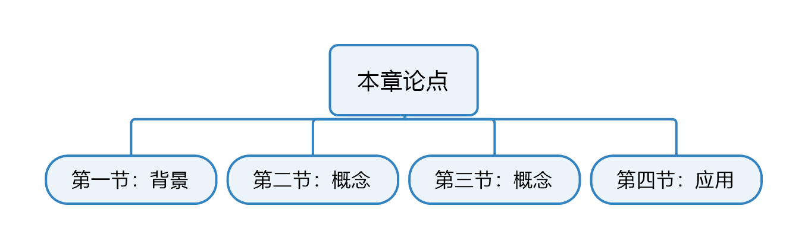
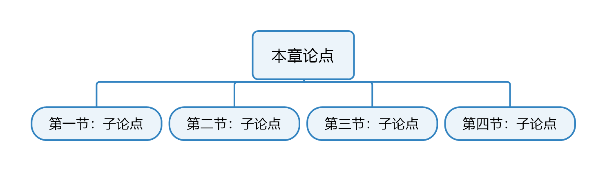
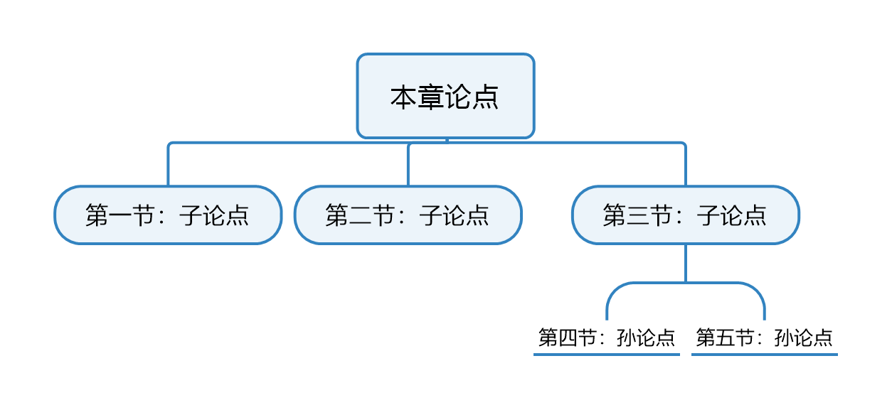

# PQ4R阅读法

[toc]

## 定义

*PQ4R法是一种基于增细加工原理学习课本教材某一章节的方法。有意义的增细加工之所以有效，可能是因为可以较好地驱动人脑的加工活动。PQ4R表示阅读的步骤，即Preview，Question，Read，Reflect，Recite，Review。*

>1. Preview：浏览整章内容，确定本章的主题。

我的思考：Preview应该是了解每一节在本章中所处的逻辑位置，是背景介绍还是作者论点/论据？中心议题还是对中心议题的进一步支撑？是谈概念还是应用？每一节之间的逻辑关系是什么？章节的常见结构如下（可参考《金字塔原理》）：

* 演绎式：各小节之间是演绎关系

* 归纳式：各小节之间是并列关系

* 多级式：各小节之间不全是同一层级的演绎或并列关系

*Question，Read，Reflect，Recite是针对每一节**而非整章**所实施的步骤。*

>2. Question：针对每一节提出问题。通常，每一节标题就可以简单转化为适当的问题。

我的思考：实际上我们在Preview的时候就应该要提一些问题，只是这两次提的问题涉及的逻辑层次不一样。这一步提出的问题，应该是针对本节内容的主题细化、概念解释、论证步骤、论据说服力等。

>3. Read：认真阅读每一节，试着找出你所提出的问题的答案。

我的思考：Read就是为你所提的论题寻找论据的过程。在这一步开始之前，应该对于论据的组织形式有个预期，是演绎论证还是归纳论证还是二者皆有？这样才能以更有序的形式把零散的论据整合起来。

>4. Reflect：在阅读的同时进行思索。通过理解文字和主动思考，将阅读材料和先验知识联系起来。

我的思考：这个过程就像卡尔曼滤波器，阅读和理解材料就是测量（个人理解与作者意图之间的偏差就是误差），主动思考即预测估计，通过贝叶斯法则不断迭代运算，更新先验知识。

>5. Recite：读完一节后，拉通回忆本节中所学内容，并回答本节开始所提出的问题。

我的思考：通过练习，增加本节知识点的记忆强度。

>6. Review：读完一章后，拉通回忆本章中所学内容，并回答本章开始所提出的问题。

我的思考：通过练习，增加本章知识点的记忆强度。这一步应该重点关注的是各小节之间的逻辑关系，而非某个小节的详细论证过程（这一步可以放在Recite中做）。

## 应用

*在弗瑞斯（Frase，1975）的一项阅读对比实验中，在测试环节中带着问题读的受试者得分更高，由此推测带着问题阅读课文更有利于理解。*

我的思考：这就是为什么在做阅读理解题之前推荐先读后面的问题，再有的放矢地读全文。

Ref:
[1]《认知心理学及其启示》，安德森，p173，p180，p182

Log:
200127:新建
200127：分为“定义”和“应用”两部分，并增加内容。
